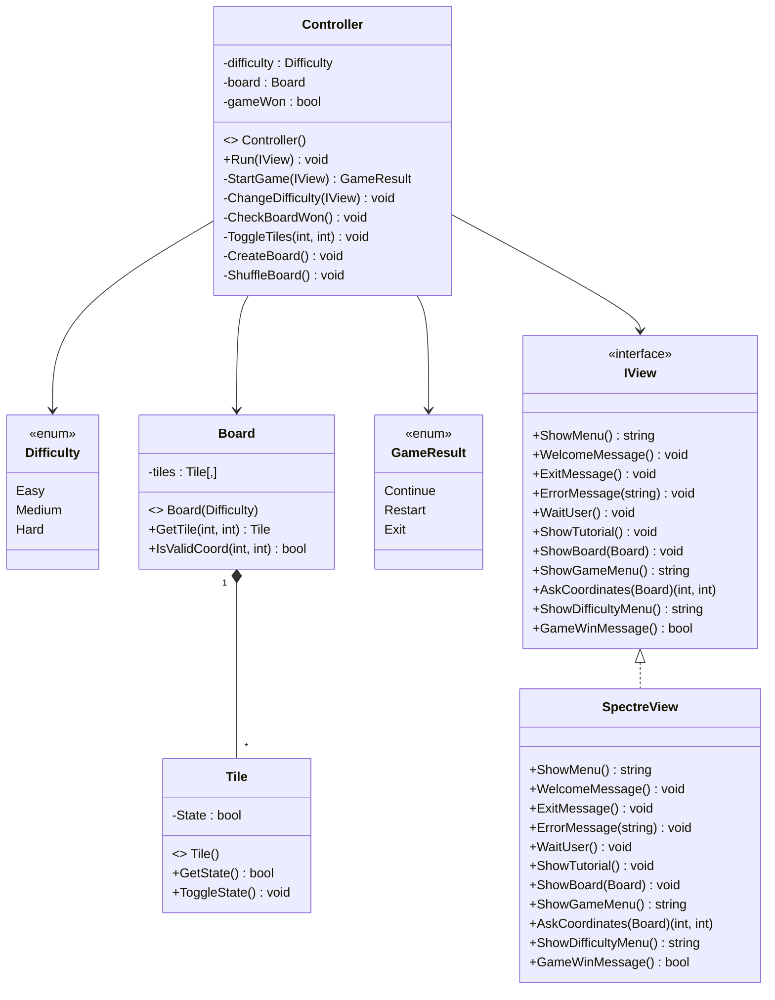

# Blockout Project Group 07

### **Authors:**

| Name | Number |
| - | - |
| João Nogueira | 22304016 |
| Mariana Marques | 22207510 |

João Nogueira:

- Everything

---

Git Repository: [GitHub] (https://github.com/Jokinhas24/Blockout_G07.git)

---

## **Solution Architecture:**

**Program.cs:**
- Instantiates a new view and a controller, starting the application.

**Controller.cs:**
- Acts as the main component of the application, controlling the game flow and coordinating interactions between the View and the Model.
- Manages the main menu, gameplay loop, and overall game state.
###### **Methods:**
- "Run(IView view)"
  - Starts the application and displays the main menu.
  - Processes user input for menu options such as Play, Difficulty, Tutorial, and Quit.
  - Controls when the game starts, restarts, or exits.
- "StartGame(IView view)"
  - Contains the main gameplay loop.
  - Displays the board and updates it after each player action.
  - Handles user input during gameplay through the game menu.
  - Calls model methods to update the board state when tiles are toggled.
  - Checks after each move if the win condition has been met.
  - Returns a GameResult to indicate whether the game should restart or exit.
- "ToggleTiles(Board board, int row, int column)"
  - Core gameplay mechanic.
  - Toggles the selected tile and its adjacent tiles (up, down, left, right), if valid.
- "ShuffleBoard()"
  - Randomly toggles a set of tiles on the board.
  - Ensures multiple unique tile positions are selected during the process to avoid immediate repetition.
  - Creates a randomized starting state for the game.
- "CheckBoardWon()"
  - Iterates through all tiles in the board.
  - Determines if all tiles are in the winning state.
  - Updates the game state when the game is won.
- "ChangeDifficulty(IView view)"
  - Allows the player to select a difficulty level.
  - Updates the board size based on the selected difficulty.
  - Recreates the board accordingly.
- "CreateBoard()"
  - Instantiates a new Board object using the current difficulty setting.

#### **Model Classes:**
- **GameResult.cs:**
  - Enum that holds the 3 game states (Continue, Restart, Exit).
- **Difficulty.cs:**
  - Enum that holds the 3 difficulty settings (Easy, Medium, Hard).

- **Tile.cs:**
  - Represents a single tile in the board.
  - Has methods that:
    - Returns current state.
    - Toggles state between On and OFF.
- **Board.cs:**
  - Represents the game board as a 2D grid of tiles.
  - Creates and stores all Tile objects.
  - Handles board size based on difficulty.
  - Had methods that:
    - Returns a tile at a given position.
    - Checks if coordinates are valid.

#### **View:**

- **IView.cs:**
  - Interface implemented by View.

- **SpectreView.cs:**
  - Implements IView interface.
  - Handles all user interaction and console outputs.
  - Displays menus, messages and the game board.
  - Collects user input and sends it to the *Controller*

---

### **Class Diagram:**

### **References:**

 - [Mermaid] https://mermaid.js.org/syntax/classDiagram.html 